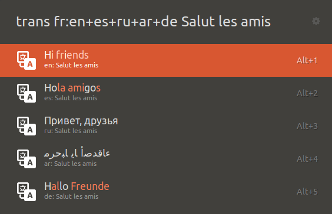

# Translate

This is a fork of the original Translate extension by Nastuzzi Samy (@NastuzziSamy) with improved functionalities.

## Table of contents

- [Preview](#preview)
- [Installation](#installation)
  - [Requirements](#requirements)
  - [Ulauncher's GUI](#ulaunchers-gui)
  - [Manually from source](#manually-from-source)
- [Configuration](#configuration)
- [Usage](#usage)
  - [Languages](#languages)
  - [Options](#options)
- [License](#license)

## Preview




<a href="https://icons8.com/">Icons by Icons8</a>

## Installation

### Requirements

This extension requires [Translate Shell](https://github.com/soimort/translate-shell#installation) in order to work.

### 1. Ulauncher's GUI

Open Ulauncher's preferences window > Extensions > Add Extension and paste the following URL:

```
https://github.com/dddddavid02/ulauncher-translate
```

### 2. Manually from source

Open the folder containing all Ulauncher extensions and move the extensions's folder inside or just `git clone` this repository.

```
$HOME/.local/share/ulauncher/extensions
```

## Configuration

In Ulauncher's settings, you can customise:
- **Translate keyword**
  - Default: `trans`

- **From language**
  - Default: `auto`
  - Indicate languages as `en`, `it`, `fr`, `es`...

- **To language**
  - [All language codes](https://github.com/soimort/translate-shell/wiki/Languages)

## Usage

To translate, open Ulauncher and type the set keyword (by default it's `trans`),  
then simply type or paste the text and wait for the result!
 
By clicking or pressing ENTER on a translation, you can select whether you want to copy it or open it in Google Translate.

### Languages

By default, it will autodetect your language and translate accordingly.

You can also specify languages in this format `from_language:to_language`.
If you decide to not indicate either one or the other parameter, the default values will be used.
It's also possible to translate to multiple languages at once using the `+` operator.

For example:

- `trans en:fr` to translate from English to French
- `trans :fr` to translate from the detected language to French
- `trans en:` to translate from English to your language
- `trans en:fr+es` to translate from English to French and Spanish

### Options

- `-sp`: to read what you entered
- `-p`: to read the translation

## License

[MIT License](LICENSE)
